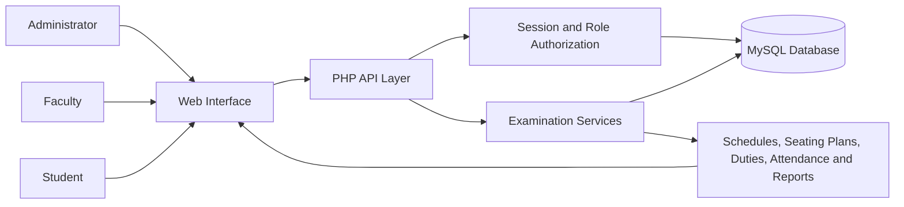
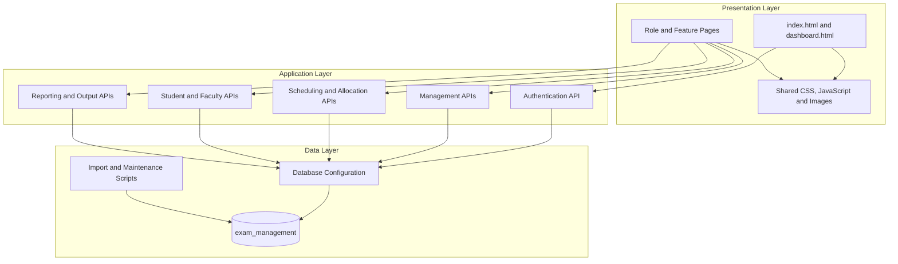
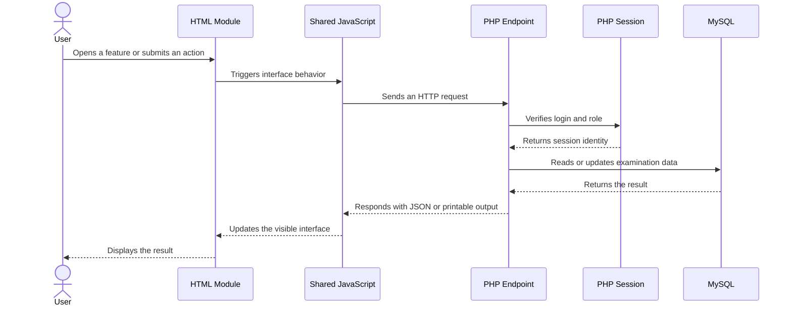
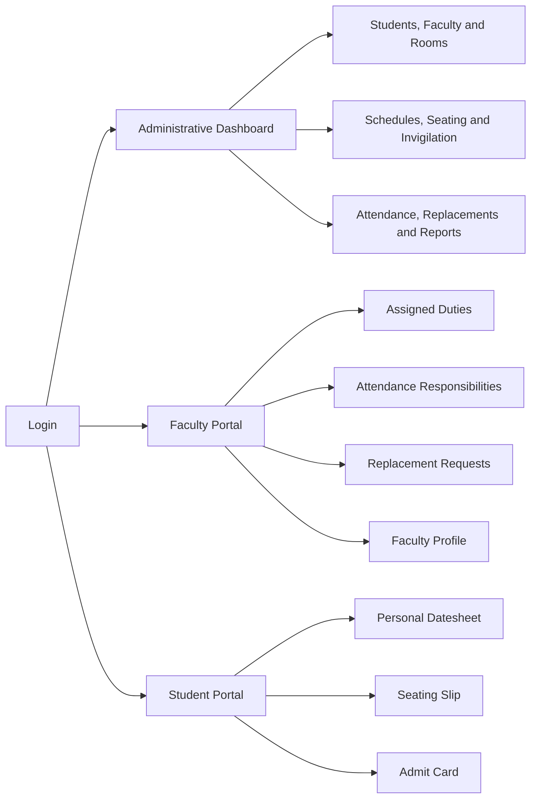
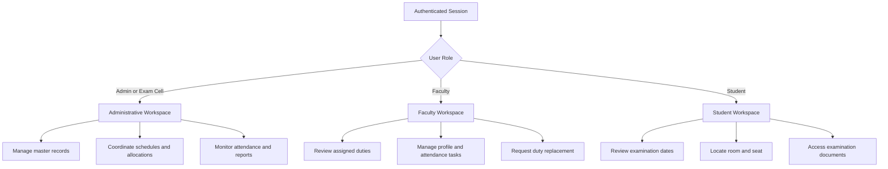
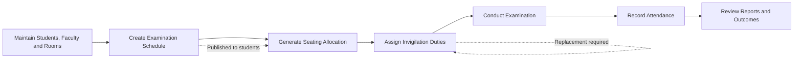
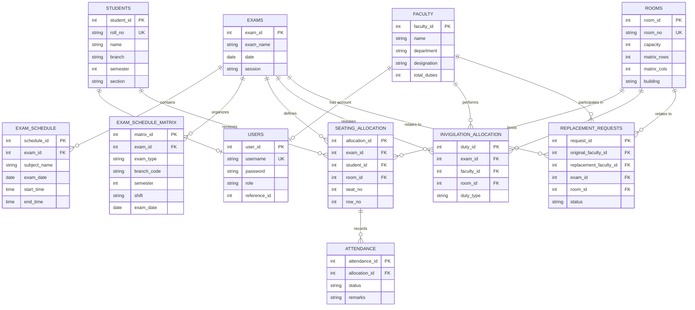

# Automated Examination Management System

> A centralized web application for coordinating examination schedules, student seating, invigilation duties, attendance, replacements, and academic reporting.

The Automated Examination Management System brings the operational parts of university examinations into one structured platform. Administrators manage examination resources, faculty members access their assigned responsibilities, and students receive personalized examination information through dedicated portals.

---

## System at a Glance



## Core Capabilities

| Area | Responsibility |
|---|---|
| Authentication | Session-based login and role-aware portal routing |
| Dashboard | High-level examination statistics, activity, and notifications |
| Students | Student records, academic identity, bulk imports, and portal access |
| Faculty | Faculty profiles, workload information, and duty access |
| Rooms | Room capacity, matrix dimensions, blocked seats, and layout metadata |
| Scheduling | Examination dates, shifts, subjects, programs, and schedule matrices |
| Seating | Automated student allocation with room and seat-level placement |
| Invigilation | Faculty duty allocation across examination rooms |
| Attendance | Room-wise attendance recording and absentee reporting |
| Replacements | Faculty replacement requests and approval workflow |
| Reports | Operational summaries, utilization metrics, and printable outputs |
| Portals | Focused student and faculty self-service experiences |

---

## Application Architecture

The project follows a lightweight client-server structure. Static HTML pages provide the interface, shared JavaScript coordinates browser behavior and API requests, PHP endpoints contain server-side operations, and MySQL stores the examination data.



### Request Lifecycle



---

## Repository Structure

```text
Auto_Exam_Management_GBU/
|
|-- api/                         Server-side application endpoints
|   |-- lib/                     Shared PHP domain helpers
|   `-- templates/               Printable output templates
|
|-- assets/                      Browser-facing shared resources
|   |-- css/                     Global visual styling
|   |-- images/                  Logos and image assets
|   `-- js/                      Shared client-side behavior
|
|-- config/                      Runtime configuration
|   `-- database.php             MySQL connection provider
|
|-- data/                        Source data used by imports
|
|-- database/                    Database definition and controlled data
|   |-- schema.sql               Canonical relational schema
|   `-- seeds/                   Development seed data
|
|-- docs/                        Supporting project documentation
|
|-- modules/                     Feature and role-specific HTML pages
|
|-- scripts/                     Optional data and maintenance utilities
|
|-- dashboard.html               Administrative application shell
|-- index.html                   Authentication entry point
|-- composer.json                PHP dependency definition
|-- package.json                 Script dependency definition
`-- README.md                    Architecture and repository guide
```

### Directory Responsibilities

#### `api/` — Server-side operations

Each endpoint groups operations around one business area. The browser communicates with these files using action-based GET or POST requests.

| Endpoint | Domain |
|---|---|
| `auth.php`, `login.php` | Authentication, session state, logout, and role routing |
| `dashboard.php` | Dashboard counts and recent examination activity |
| `students.php`, `student.php` | Administrative student management and student self-service |
| `faculty.php`, `faculty-portal.php` | Faculty administration, profile, and duty views |
| `rooms.php` | Examination room records and physical seating layouts |
| `schedule.php`, `exam-schedule-matrix.php` | Standard schedules and university matrix schedules |
| `seating.php`, `seating-plan.php` | Allocation generation and room-wise seating plans |
| `seating-pdf.php` | Printable seating-plan output |
| `invigilation.php` | Faculty-to-room duty allocation |
| `attendance.php` | Attendance sheets, marking, and absentee exports |
| `replacement.php` | Invigilation replacement workflow |
| `reports.php` | Cross-module analytics and operational reports |
| `notifications.php` | Role-visible examination announcements |
| `chatbot.php` | Contextual application guidance |

#### `modules/` — User-facing features

The modules directory separates major workflows into focused pages while sharing the same visual system and browser utilities.



#### `assets/` — Shared presentation resources

- `assets/css/style.css` defines the shared visual language across authentication, dashboards, portals, tables, forms, cards, and printable views.
- `assets/js/script.js` provides common navigation, theme handling, reusable interactions, and contextual assistance.
- `assets/images/` contains visual identity assets used throughout the application and generated documents.

#### `database/` — Relational model

- `schema.sql` is the structural definition of the application database.
- `seeds/` contains controlled development data kept separate from the schema.

#### `scripts/` and `data/` — Maintenance workspace

These directories support repeatable imports, cleanup operations, faculty-data synchronization, roll-number processing, and room-capacity maintenance. They are operational helpers rather than runtime browser dependencies.

---

## Role-Based Experience



| Role | Primary Workspace | Scope |
|---|---|---|
| Admin | Administrative dashboard | Full operational management |
| Exam Cell | Administrative dashboard | Examination coordination |
| Faculty | Faculty portal | Personal duties, attendance responsibilities, and replacements |
| Student | Student portal | Personal schedule, seating, profile, and examination documents |

---

## Examination Workflow



The workflow is intentionally modular: schedules define when examinations occur, room data defines available capacity, student data determines allocation demand, and faculty data supports duty coverage. Attendance and reporting consume the resulting allocations rather than duplicating them.

---

## Data Model



### Data Ownership by Domain

| Domain | Primary tables | Downstream consumers |
|---|---|---|
| Identity | `users`, `students`, `faculty` | Authentication, portals, allocations |
| Examination planning | `exams`, `exam_schedule`, `exam_schedule_matrix` | Datesheets, seating, duties, reports |
| Physical resources | `rooms` | Seating plans, invigilation, utilization reports |
| Operations | `seating_allocation`, `invigilation_allocation` | Portals, attendance, printable outputs |
| Examination outcomes | `attendance` | Absentee reports and analytics |
| Duty continuity | `replacement_requests`, `replacement_log` | Faculty and administrative workflows |

---

## Design Principles Reflected in the Structure

- **Domain separation:** student, faculty, room, schedule, seating, and reporting responsibilities have distinct endpoints and pages.
- **Shared presentation layer:** common assets prevent individual modules from duplicating styling and browser behavior.
- **Role-focused navigation:** each user type enters a workspace suited to its responsibilities.
- **Relational consistency:** allocations connect existing examinations, students, faculty members, and rooms through foreign keys.
- **Operational traceability:** attendance and replacement records remain connected to the allocations that produced them.
- **Maintainable supporting material:** architecture documents, database files, seed data, imports, and runtime code occupy separate directories.

---

## Technology Profile

| Layer | Technology |
|---|---|
| Interface | HTML5 and CSS3 |
| Browser behavior | Vanilla JavaScript and Fetch API |
| Server | PHP 8-compatible endpoints |
| Persistence | MySQL / MariaDB |
| Sessions | Native PHP sessions |
| Printable documents | Browser print layouts and PHP-generated output |
| Maintenance utilities | Node.js with `mysql2` |
| Dependency management | Composer and npm |

---

<div align="center">

### One system. Three workspaces. A complete examination workflow.

**Plan examinations · Allocate resources · Coordinate people · Inform students · Measure outcomes**

</div>
