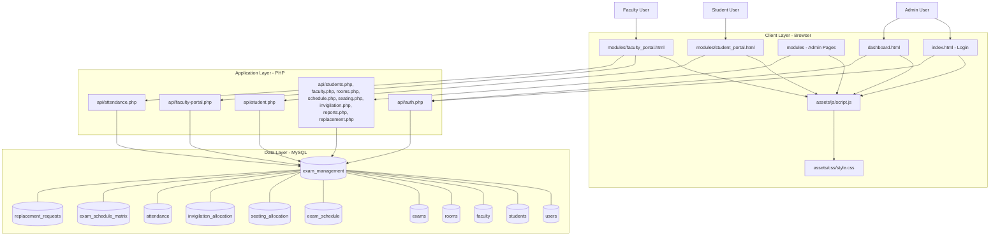
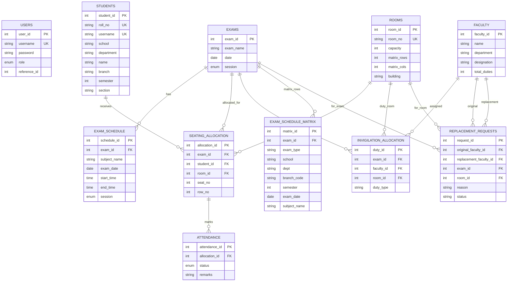
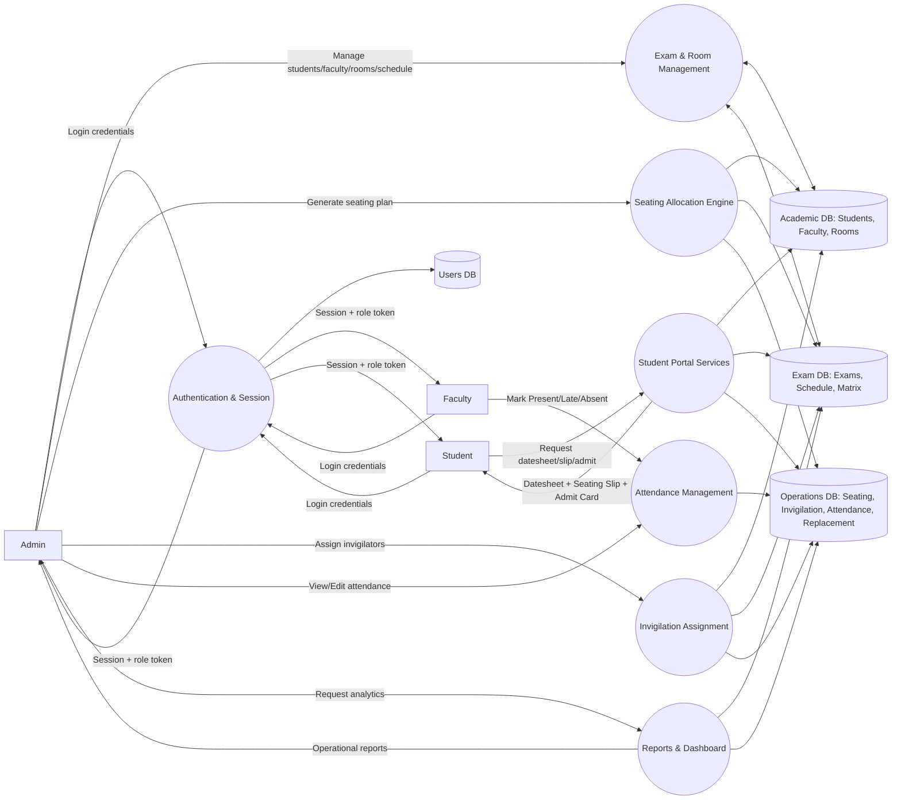
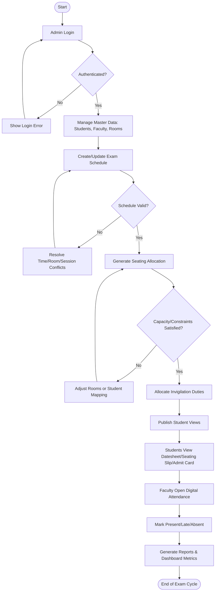
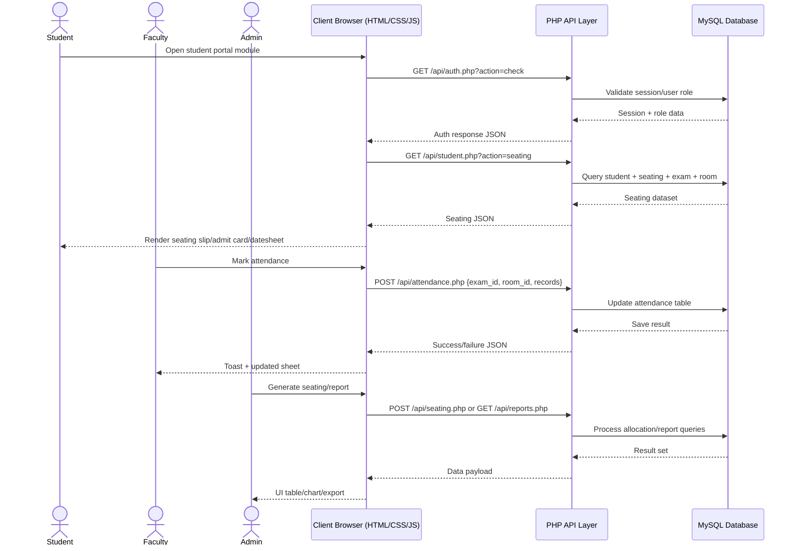

# Exam Management System Diagrams

These diagrams are tailored to the current project structure (`api/`, `modules/`, `config/database.php`, `database/schema.sql`) and the live workflow used by Admin, Faculty, and Student roles.

## 1. Architecture Diagram

## 2. ER Diagram

## 3. Data Flow Diagram (Level 1)

## 4. Activity Diagram (Exam Lifecycle)

## 5. Client-Server Model

